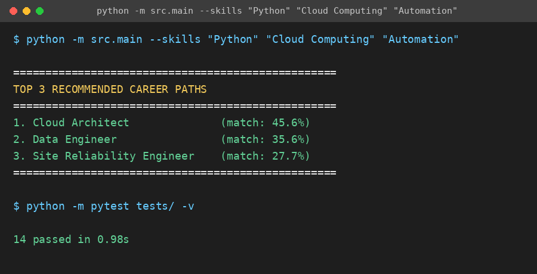

# 🧭 Tech Stack Recommender

**Project 3 — DecodeLabs AI Industrial Training Kit (Batch 2026)**

[](https://github.com/YOUR-USERNAME/tech-stack-recommender/actions/workflows/tests.yml)
[](https://www.python.org/downloads/)
[](LICENSE)

A **content-based recommendation engine** that maps a user's raw skills to the job roles that best match them — using **TF-IDF feature weighting** and **Cosine Similarity**, the same core mathematics behind real-world recommenders like Netflix and Amazon.

## 🎯 Goal

Given three (or more) skills a user enters (e.g. `Python`, `Cloud Computing`, `Automation`), rank all known job roles by how closely their required skill sets align with the user's input, and return the **Top 3** most relevant career paths.

This is **content-based filtering**, not collaborative filtering: recommendations come purely from matching item attributes (job role skill requirements) to user attributes (entered skills) — no historical user-interaction data is needed, which also makes the system naturally resistant to the "item cold start" problem.

## 📸 Demo



## 🧠 Pipeline (4-Step Ranking Pipeline)

| Step | What happens | Module |
|---|---|---|
| **1. Ingestion** | Capture the user's skills (minimum 3 inputs) | `src/main.py` |
| **2. Scoring** | Convert skills + job-role requirements into TF-IDF vectors over a shared vocabulary, then compute Cosine Similarity between the user vector and every job role vector | `src/vectorizer.py`, `src/recommender.py` |
| **3. Sorting** | Sort all job roles by similarity score, descending | `src/recommender.py` |
| **4. Filtering** | Truncate to the Top-N (default 3) highest-scoring roles | `src/recommender.py` |

### Why TF-IDF + Cosine Similarity (not plain binary overlap)?

- **Binary/Jaccard overlap** treats every skill as equally important — "Python" counts the same as "Software". That's a problem: generic, high-frequency terms should carry *less* weight than specific, descriptive ones.
- **TF-IDF** (Term Frequency × Inverse Document Frequency) fixes this — it rewards skills that are specific to a role and penalizes skills that show up everywhere.
- **Cosine Similarity** measures the *angle* between the user's skill vector and each role's skill vector, so it's unaffected by how many total skills a role lists (unlike Euclidean distance, which is sensitive to vector magnitude).

## 📁 Project Structure
```
tech-stack-recommender/
├── .github/
│   └── workflows/
│       └── tests.yml        # CI: runs the test suite on every push/PR
├── README.md
├── LICENSE
├── .gitignore
├── requirements.txt
├── data/
│   └── raw_skills.csv       # job roles mapped to their defining skills
├── assets/
│   └── demo.png             # CLI output screenshot
├── src/
│   ├── __init__.py
│   ├── data_loader.py       # loads & validates the skills dataset
│   ├── vectorizer.py        # TF-IDF vectorization over a shared vocabulary
│   ├── recommender.py       # cosine similarity scoring, sorting, top-N filtering
│   └── main.py              # CLI entry point
└── tests/
    └── test_recommender.py  # pipeline sanity tests
```

## 🚀 Getting Started

### Prerequisites
- Python 3.9+

### Installation
```bash
git clone https://github.com/<your-username>/tech-stack-recommender.git
cd tech-stack-recommender
pip install -r requirements.txt
```

### Run it
```bash
python -m src.main --skills "Python" "Cloud Computing" "Automation"
```

Or run it interactively (it will prompt you for skills):
```bash
python -m src.main
```

### Example output
```
==================================================
TOP 3 RECOMMENDED CAREER PATHS
==================================================
1. DevOps Engineer         (match: 78.4%)
2. Cloud Architect          (match: 71.2%)
3. Site Reliability Engineer (match: 65.9%)
==================================================
```

### Run tests
```bash
python -m pytest tests/
```

## 🧊 The Cold Start Problem

A brand-new user with zero prior history has no data for a similarity engine to work with — multiplying any item vector by a vector of zeros always yields zero. This project sidesteps the *user* cold start by requiring an explicit "onboarding survey" step (the user must type in at least 3 skills up front), and it's naturally immune to the *item* cold start since new job roles just need their skill list added to `data/raw_skills.csv` — no historical interaction data required.

## 🛠 Key Concepts Demonstrated
- Content-based filtering vs. collaborative filtering
- Vector space modeling of qualitative text data
- TF-IDF feature weighting
- Cosine similarity as an orientation-based (magnitude-invariant) distance metric
- The 4-step ranking pipeline: Ingestion → Scoring → Sorting → Filtering
- Handling the cold-start problem

## 📌 Possible Extensions
- Expand `data/raw_skills.csv` with more roles and more granular skills
- Add skill synonyms / normalization (e.g. "JS" → "JavaScript") so the vocabulary matches more reliably
- Weight user-entered skills by proficiency level instead of treating all as equal
- Add a simple web UI on top of the same `recommender.py` logic

## 📄 License

This project is licensed under the [MIT License](LICENSE) — free to use, modify, and share.

---
Built as part of the DecodeLabs Industrial Training Kit — Batch 2026.
